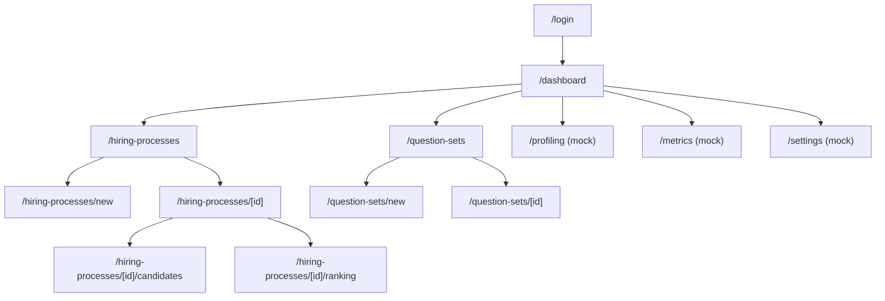

# riwi-match (frontend)

Frontend de **RIWI Match**: la app web que usan los reclutadores para crear procesos de contratación, subir CVs, revisar el ranking de candidatos generado por IA, gestionar el consentimiento por WhatsApp, y (a futuro) monitorear el profiling por voz.

Stack: **Next.js 16 (App Router)** + **React 19** + **TypeScript** + **Tailwind CSS v4** + **React Query v5** + **Axios** + **react-hook-form + Zod**.

Consume el backend [`cv-match-api`](../cv-match-api/README.md) (FastAPI). Todo lo que hace este frontend hoy que "parece funcionar pero no hace nada real" está documentado en la sección 12 (son mocks explícitos, no bugs escondidos).

---

## 1. Descripción General

La app tiene dos zonas:

- **`(auth)`** — pantalla de login pública.
- **`(dashboard)`** — todo lo demás, protegido: requiere estar autenticado (`AuthContext`) o redirige a `/login`.

Flujo principal de un reclutador:
1. Crea un proceso de contratación (`/hiring-processes/new`, wizard de 3 pasos: datos básicos → Job Description → subir CVs).
2. El detalle del proceso (`/hiring-processes/[id]`) muestra un stepper de 4 fases (JD → CVs → Match → Profiling) y permite disparar el matching.
3. Revisa el ranking de candidatos en dos vistas distintas:
   - `/hiring-processes/[id]/candidates` — lista plana con rank explícito, notas, override manual.
   - `/hiring-processes/[id]/ranking` — kanban por categoría (Alto/Medio/Bajo), con selección múltiple y **envío de WhatsApp** (individual o masivo) a los candidatos elegibles.
4. Administra `question-sets` (bancos de preguntas para el futuro profiling por voz).
5. Ve `metrics` (costos de IA) y `profiling` (monitor de llamadas) — **ambas páginas están conectadas a datos mock, no al backend real todavía**.

---

## 2. En qué fase está el proyecto

Comparte fases con el backend (ver [README del backend](../cv-match-api/README.md#2-en-qué-fase-está-el-proyecto)); desde la perspectiva del frontend:

| Fase | Estado | Qué incluye en el frontend |
|---|---|---|
| **Fundaciones + diseño visual** | ✅ Completa | Login, layout de dashboard, `FloatingNav` posicionable, paleta violeta, todos los rediseños visuales (ver historial de commits `design: ...`) |
| **Gestión de procesos y CVs** | ✅ Completa | Wizard de creación, detalle de proceso, upload de CVs, editor de JD |
| **Ranking / Match** | ✅ Completa | Kanban dual (CV + Profiling), vista de ranking plano, breakdown de IA, override manual |
| **WhatsApp** | 🔶 En curso | Badge de estado + botón individual + botón masivo ya conectados al backend real (`processesApi.sendWhatsApp`). Bloqueado por el mismo motivo que el backend: plantilla de Meta pendiente de aprobación |
| **Profiling por voz** | ⬜ No iniciada | La página `/profiling` existe visualmente pero todo el `processesApi.startProfiling`/`getProfilingRuns` es mock — el backend tampoco lo tiene implementado |
| **Settings / Métricas reales** | ⬜ No iniciada | `/settings` y `/metrics` tienen UI completa pero `settingsApi.*` y `metricsApi.getDashboard` son 100% `Promise.resolve()` con datos vacíos o hardcodeados |

---

## 3. Instalación y Ejecución

### Requisitos
- Node.js 18.18+ (requerido por Next.js 16)
- El backend [`cv-match-api`](../cv-match-api/README.md) corriendo (por defecto en `http://localhost:8000`)

### Setup

```bash
npm install

# Variable de entorno opcional — si no se define, usa http://localhost:8000
# Crea .env.local con:
# NEXT_PUBLIC_API_URL=http://localhost:8000

npm run dev
```

Abre [http://localhost:3000](http://localhost:3000). Si el puerto 3000 está ocupado, Next.js usa el siguiente disponible (3001, etc.) automáticamente.

### Scripts (`package.json`)
| Script | Qué hace |
|---|---|
| `npm run dev` | Servidor de desarrollo (Turbopack) |
| `npm run build` | Build de producción |
| `npm run start` | Sirve el build de producción |
| `npm run lint` | ESLint (`eslint-config-next` + reglas TypeScript) |

> No hay ningún framework de testing configurado (sin Jest/Vitest/Playwright en `package.json`) — ver sección 12 y 13.

---

## 4. Usuarios de Prueba

El login llama a `POST /api/v1/auth/login` del backend real — no hay usuarios hardcodeados en el frontend. Usa los mismos usuarios de prueba del [backend](../cv-match-api/README.md#4-usuarios-de-prueba):

| Rol | Email | Password |
|---|---|---|
| Recruiter | `recruiter@riwi.io` | `riwi2026` |

La pantalla de login (`/login`) tiene un botón de "quick access" que probablemente rellena estas credenciales de prueba automáticamente — revisa [`src/app/(auth)/login/page.tsx`](src/app/(auth)/login/page.tsx).

---

## 5. Tecnologías Utilizadas (patrones y conceptos aplicados)

- **Next.js 16 App Router** con **route groups** (`(auth)`, `(dashboard)`) para separar layouts sin afectar la URL.
- **React 19** — uso del nuevo hook `use()` para desenvolver `params: Promise<{id}>` en páginas dinámicas (patrón nuevo de Next 16, reemplaza el antiguo acceso directo a `params`).
- **React Query v5** (`useQuery`/`useMutation`/`useQueryClient`) — cache de datos del servidor, invalidación tras mutaciones, `refetchInterval` para polling (ej. kanban se refresca cada 20s).
- **Patrón adaptador en el cliente API** (`src/lib/api.ts`): el backend devuelve formas de datos distintas a las que la UI necesita (ej. lista plana → estructura de kanban por categoría); las funciones `adaptCandidatesToKanban`, `adaptProcess`, `adaptProcessDetail`, `adaptStatus` hacen esa traducción en un solo lugar.
- **Contextos de React para estado global ligero** (`AuthContext`, `NavbarPositionContext`) en vez de una librería de estado — ambos persisten en `localStorage`.
- **react-hook-form + Zod** — validación de formularios (login, creación de proceso) con schemas declarativos y `zodResolver`.
- **Interceptores de Axios** — inyecta el Bearer token en cada request y hace logout automático + redirect a `/login` ante un 401.
- **Tailwind CSS v4** con estilos inline (`style={{...}}`) para paletas de color dinámicas por categoría/estado, combinado con clases utilitarias para layout.
- **Componentes de UI propios y pequeños** (`Button`, `Badge`, `Card`, `Input`) en vez de una librería de componentes — variantes controladas por props (`variant`, `size`).
- **Mock data explícito** (`src/lib/mockData.ts`) para las partes del producto que el backend aún no implementa (profiling, settings, metrics) — permite que la UI de esas secciones se vea completa mientras se conecta el backend real.

---

## 6. Estructura Completa de Archivos

```
riwi-match/
├── src/
│   ├── app/
│   │   ├── page.tsx                                    # redirect a /dashboard
│   │   ├── layout.tsx                                   # layout raíz (fuentes, AuthProvider, QueryClientProvider)
│   │   ├── providers.tsx                                # QueryClientProvider (staleTime 30s, retry: 1)
│   │   ├── (auth)/
│   │   │   └── login/page.tsx                           # formulario login + recovery + quick access
│   │   └── (dashboard)/
│   │       ├── layout.tsx                               # protección de ruta + FloatingNav
│   │       ├── dashboard/page.tsx                        # stats, gráfico de procesos por área, recientes
│   │       ├── hiring-processes/
│   │       │   ├── page.tsx                              # lista de procesos (search + filtro status)
│   │       │   ├── new/page.tsx                          # wizard 3 pasos: básicos → JD → CVs
│   │       │   └── [id]/
│   │       │       ├── page.tsx                          # detalle: stepper JD/CVs/Match/Profiling
│   │       │       ├── candidates/page.tsx                # ranking plano con breakdown y notas
│   │       │       └── ranking/page.tsx                   # kanban dual (CV+Profiling) + WhatsApp
│   │       ├── question-sets/
│   │       │   ├── page.tsx                              # grid de sets (v#, status)
│   │       │   ├── new/page.tsx                          # crear/editar set
│   │       │   └── [id]/page.tsx                          # detalle + CRUD de preguntas
│   │       ├── profiling/page.tsx                         # monitor de llamadas (mock)
│   │       ├── metrics/page.tsx                           # costos de IA (mock)
│   │       └── settings/page.tsx                          # usuarios / parámetros IA / integraciones (mock)
│   ├── components/
│   │   ├── layout/
│   │   │   ├── FloatingNav.tsx                            # navbar flotante, 4 posiciones, persistida
│   │   │   ├── Header.tsx                                  # encabezado con título/búsqueda/usuario
│   │   │   └── Sidebar.tsx                                 # revisar si sigue en uso (ver sección 12)
│   │   └── ui/
│   │       ├── Button.tsx                                  # variants: primary/secondary/ghost/danger/outline/accent
│   │       ├── Card.tsx                                     # Card, CardHeader, CardContent, CardFooter
│   │       ├── Badge.tsx                                    # MatchBadge, StatusBadge
│   │       ├── Input.tsx                                    # Input, Select, Textarea
│   │       ├── CircularProgress.tsx                         # indicador circular de progreso
│   │       ├── UploadCvsModal.tsx                           # modal drag-drop de CVs
│   │       └── PdfPreviewModal.tsx                          # modal de preview de PDF embebido
│   ├── contexts/
│   │   ├── AuthContext.tsx                                 # useAuth() — token, role, login(), logout()
│   │   └── NavbarPositionContext.tsx                       # useNavbarPosition() — persistida en localStorage
│   └── lib/
│       ├── api.ts                                          # cliente axios + 6 objetos API + adaptadores
│       ├── types.ts                                        # 45+ interfaces/types compartidos
│       ├── utils.ts                                        # cn(), formatCurrency/Date/Percent, configs de color
│       └── mockData.ts                                     # datos ficticios para profiling/settings/metrics
├── package.json
├── next.config.ts
├── tsconfig.json
├── eslint.config.mjs
├── postcss.config.mjs
├── AGENTS.md                                               # advertencia: Next.js 16 tiene breaking changes vs. training data
└── CLAUDE.md                                               # referencia a AGENTS.md
```

---

## 7. Hooks de React Utilizados

| Hook | Dónde se usa | Para qué |
|---|---|---|
| `useState` | ~20 archivos: formularios, modales, filtros, pasos de wizard | Estado local de UI |
| `useEffect` | `(dashboard)/layout.tsx`, `AuthContext`, `NavbarPositionContext` | Verificar auth al montar y redirigir; sincronizar con `localStorage` |
| `useContext` (vía `useAuth()`/`useNavbarPosition()`) | ~15 componentes | Leer token/rol y posición de navbar sin prop drilling |
| `useCallback` | `[id]/page.tsx` (handleUpload), `[id]/ranking/page.tsx` (drag handlers) | Evitar recrear handlers en cada render |
| `useRef` | `[id]/page.tsx` (input de archivo, textarea de JD) | Referencias a elementos del DOM sin re-render |
| `use()` (React 19) | `[id]/page.tsx`, `[id]/ranking/page.tsx`, `[id]/candidates/page.tsx` | Desenvolver `params: Promise<{id}>` (patrón nuevo de Next 16 para route params) |
| `useQuery` (react-query) | ~12 páginas: lista de procesos, detalle, candidatos, question sets, métricas | Fetch + cache de datos del servidor, con `refetchInterval` en el kanban |
| `useMutation` (react-query) | Upload de JD/CVs, disparar match, enviar WhatsApp (individual y masivo), CRUD de question sets | Operaciones de escritura con `onSuccess`/`onError` e invalidación de queries |
| `useQueryClient` | Todas las páginas que mutan datos | `invalidateQueries()` tras una mutación exitosa |
| `useForm` (react-hook-form) | `login/page.tsx`, `hiring-processes/new/page.tsx` | Manejo de formularios con validación |
| `zodResolver` | Junto a `useForm` en los mismos archivos | Conecta schemas de Zod con react-hook-form |

**Hooks personalizados definidos:**
- `useAuth()` — [`src/contexts/AuthContext.tsx`](src/contexts/AuthContext.tsx): expone `token`, `role`, `isAuthenticated`, `isLoading`, `login()`, `logout()`.
- `useNavbarPosition()` — [`src/contexts/NavbarPositionContext.tsx`](src/contexts/NavbarPositionContext.tsx): expone `position` (`left`/`right`/`top`/`bottom`) y `setPosition()`.

---

## 8. Funcionalidades y Dónde Encontrar el Código

| Funcionalidad | Página / componente | Cliente API usado |
|---|---|---|
| Login | [`src/app/(auth)/login/page.tsx`](src/app/(auth)/login/page.tsx) | `authApi.login` |
| Protección de rutas del dashboard | [`src/app/(dashboard)/layout.tsx`](src/app/(dashboard)/layout.tsx) | `useAuth()` |
| Navbar flotante posicionable | [`src/components/layout/FloatingNav.tsx`](src/components/layout/FloatingNav.tsx) | `useNavbarPosition()` |
| Dashboard con stats y gráfico | [`src/app/(dashboard)/dashboard/page.tsx`](src/app/(dashboard)/dashboard/page.tsx) | `processesApi.list` |
| Lista de procesos con búsqueda/filtro | [`src/app/(dashboard)/hiring-processes/page.tsx`](src/app/(dashboard)/hiring-processes/page.tsx) | `processesApi.list` |
| Crear proceso (wizard 3 pasos) | [`src/app/(dashboard)/hiring-processes/new/page.tsx`](src/app/(dashboard)/hiring-processes/new/page.tsx) | `processesApi.create`, `.saveJD`, `.uploadJDFile`, `.uploadCandidates` |
| Detalle de proceso + stepper | [`src/app/(dashboard)/hiring-processes/[id]/page.tsx`](src/app/(dashboard)/hiring-processes/%5Bid%5D/page.tsx) | `processesApi.get`, `.getJD`, `.startMatch`, `.getMatchStatus` |
| Ranking plano con breakdown | [`src/app/(dashboard)/hiring-processes/[id]/candidates/page.tsx`](src/app/(dashboard)/hiring-processes/%5Bid%5D/candidates/page.tsx) | `processesApi.getCandidatesList`, `.getCandidateDetail` |
| Kanban dual + WhatsApp (individual y masivo) | [`src/app/(dashboard)/hiring-processes/[id]/ranking/page.tsx`](src/app/(dashboard)/hiring-processes/%5Bid%5D/ranking/page.tsx) | `processesApi.getKanban`, `.sendWhatsApp` |
| CRUD de question sets | [`src/app/(dashboard)/question-sets/`](src/app/(dashboard)/question-sets/) | `questionSetsApi.*` |
| Monitor de profiling (mock) | [`src/app/(dashboard)/profiling/page.tsx`](src/app/(dashboard)/profiling/page.tsx) | `processesApi.getProfilingRuns` (stub) |
| Métricas de costos (mock) | [`src/app/(dashboard)/metrics/page.tsx`](src/app/(dashboard)/metrics/page.tsx) | `metricsApi.getDashboard` (stub) |
| Settings (mock) | [`src/app/(dashboard)/settings/page.tsx`](src/app/(dashboard)/settings/page.tsx) | `settingsApi.*` (todos stub) |
| Descarga/preview de CV | [`src/components/ui/PdfPreviewModal.tsx`](src/components/ui/PdfPreviewModal.tsx) | `processesApi.getCvFileUrl` / `.getNormalizedCvFileUrl` |
| Upload de CVs (drag & drop) | [`src/components/ui/UploadCvsModal.tsx`](src/components/ui/UploadCvsModal.tsx) | `processesApi.uploadCandidates` |

---

## 9. Documentación de Endpoints API (cliente `src/lib/api.ts`)

Este frontend no expone API propia — consume el backend. Mapeo completo de funciones del cliente a endpoints reales:

### `authApi`
| Función | Endpoint backend |
|---|---|
| `login(email, password)` | `POST /api/v1/auth/login` |

### `processesApi`
| Función | Endpoint backend | Notas |
|---|---|---|
| `list()` | `GET /api/v1/processes` | Adapta con `adaptProcess` |
| `create(dto)` | `POST /api/v1/processes` | |
| `get(id)` | `GET /api/v1/processes/{id}` | Adapta con `adaptProcessDetail` |
| `getJD(id)` | `GET /api/v1/processes/{id}` | Extrae `job_description` de la respuesta |
| `parseJD(id, rawText)` | — | **Mock**: no hay endpoint de parseo IA de JD en el backend, devuelve `structured_jd` vacío |
| `saveJD(id, rawText)` | `POST /api/v1/processes/{id}/job-description` | |
| `uploadJDFile(id, file)` | `POST /api/v1/processes/{id}/job-description/upload` | multipart/form-data |
| `getJDFileUrl(id)` | `GET /api/v1/processes/{id}/job-description/file` | Devuelve la URL, no hace el fetch |
| `uploadCandidates(id, files)` | `POST /api/v1/processes/{id}/candidates/upload` | multipart/form-data |
| `startMatch(id)` | `POST /api/v1/processes/{id}/match` | |
| `getMatchStatus(id)` | `GET /api/v1/processes/{id}/match/status` | |
| `getKanban(id)` | `GET /api/v1/processes/{id}/candidates` | Adapta lista plana → `{HIGH,MEDIUM,LOW,LOADED,PARSING}` con `adaptCandidatesToKanban` |
| `getCandidatesList(id)` | `GET /api/v1/processes/{id}/candidates` | Sin adaptar, formato plano con `rank` |
| `getCandidateDetail(processId, pcId)` | `GET /api/v1/processes/{processId}/candidates/{pcId}` | |
| `getCvFileUrl` / `getNormalizedCvFileUrl` | `GET .../cv/file`, `GET .../cv-normalized/file` | Construye la URL directamente (redirect 302 del backend) |
| `sendWhatsApp(processId, pcId)` | `POST /api/v1/processes/{processId}/candidates/{pcId}/whatsapp/send` | Real, conectado |
| `startProfiling(id, candidateIds)` | — | **Mock**: backend no tiene este endpoint todavía |
| `getProfilingRuns(id)` | — | **Mock**: devuelve `[]` |

### `candidatesApi`
| Función | Endpoint backend |
|---|---|
| `updateNotes(pcId, notes)` | — **Mock** (el backend sí tiene `PATCH .../override` pero esta función no lo usa; revisar) |
| `updateStatus(pcId, status)` | — **Mock** |

### `questionSetsApi`
| Función | Endpoint backend |
|---|---|
| `list()` | `GET /api/v1/question-sets` |
| `get(id)` | `GET /api/v1/question-sets/{id}` |
| `create(dto)` | `POST /api/v1/question-sets` |
| `update(id, data)` | `PATCH /api/v1/question-sets/{id}` |
| `delete(id)` | `DELETE /api/v1/question-sets/{id}` |
| `addQuestion(setId, q)` | `POST /api/v1/question-sets/{setId}/questions` |
| `updateQuestion(setId, qId, q)` | `PATCH /api/v1/question-sets/{setId}/questions/{qId}` |
| `deleteQuestion(setId, qId)` | `DELETE /api/v1/question-sets/{setId}/questions/{qId}` |

### `settingsApi` y `metricsApi`
Todas sus funciones son **100% mock** (`Promise.resolve()` con datos vacíos/hardcodeados) — el backend no expone estos endpoints todavía.

---

## 10. Diagrama Entidad-Relación

Este frontend no tiene base de datos propia. El modelo de datos real vive en el backend — ver el [ERD completo en `cv-match-api/README.md`](../cv-match-api/README.md#9-diagrama-entidad-relación). Los tipos TypeScript en [`src/lib/types.ts`](src/lib/types.ts) son el espejo (parcial y a veces adaptado) de esas entidades del lado del cliente.

### Mapa de navegación (rutas del App Router)



---

## 11. Decisiones Arquitectónicas

- **Dos vistas de candidatos distintas** (`candidates/page.tsx` ranking plano vs. `ranking/page.tsx` kanban dual) en vez de una sola configurable — se priorizó iterar rápido en cada vista para casos de uso ligeramente distintos (revisión detallada vs. acción masiva), a costa de duplicar parte de la lógica de adaptación de datos.
- **Adaptadores centralizados en `api.ts`** en vez de que cada página transforme la respuesta del backend — un solo lugar (`adaptCandidatesToKanban`, `adaptProcess`, etc.) traduce el contrato del backend al que espera la UI, así un cambio de forma de datos del backend se ajusta en un solo archivo.
- **Mock data explícito y declarado como tal** (`mockData.ts`, funciones que retornan `Promise.resolve()`) para las secciones sin backend (profiling, settings, metrics) en vez de ocultar la sección — permite demostrar/diseñar el producto completo mientras el backend se pone al día.
- **Contexts de React en vez de una librería de estado global** (Redux/Zustand) — la única necesidad real es compartir `auth` y `navbar position`, ambos simples y persistidos en `localStorage`; no se justificaba una dependencia adicional.
- **React Query como única fuente de estado de servidor** — nada de estado de servidor se duplica manualmente en `useState`; se confía en `staleTime`/`refetchInterval`/`invalidateQueries`.
- **Sin librería de toasts/notificaciones** — los errores de mutaciones (ej. envío de WhatsApp fallido) se muestran inline en la propia tarjeta del candidato en vez de con un sistema global de notificaciones, para no sumar una dependencia por un caso de uso todavía acotado.
- **Botón único "Iniciar profiling"** en el kanban dispara hoy el envío real de WhatsApp (no un endpoint de profiling, que no existe) — decisión consciente: el primer paso real para "iniciar profiling" en el flujo actual del producto es obtener el consentimiento por WhatsApp, así que se fusionó ahí en vez de mantener dos botones cuando uno era un stub sin efecto.

---

## 12. Errores/Bugs Conocidos

1. **`README.md` original era el boilerplate de `create-next-app`** (este archivo lo reemplaza).
2. **`mockData.ts` (1138 líneas)** — no está confirmado si alguna página todavía lo importa activamente tras conectar las APIs reales de procesos/candidatos; revisar y eliminar lo que ya no se use para no confundir a quien lea el código pensando que son datos reales.
3. **Login "¿olvidaste tu contraseña?" es 100% mock** — usa `setTimeout` para simular el envío, no llama a ningún endpoint (el backend tampoco tiene uno de recuperación de contraseña todavía).
4. **`src/components/layout/Sidebar.tsx` posiblemente sin uso** — el layout actual usa `FloatingNav`, no está confirmado si `Sidebar.tsx` quedó como código muerto de un diseño anterior.
5. **`candidatesApi.updateNotes`/`updateStatus` son mock** aunque el backend sí tiene un endpoint real equivalente (`PATCH /processes/{id}/candidates/{pc_id}/override`) que otras partes de la UI sí usan directamente vía `processesApi` — inconsistencia a unificar.
6. **Sin ningún framework de testing configurado** — no hay Jest, Vitest, Testing Library ni Playwright en `package.json`.
7. **`processesApi.startProfiling` y `getProfilingRuns` son mock** porque el backend no tiene esa funcionalidad implementada (ver README del backend, Fase 4).
8. Dependiente del mismo bloqueo que el backend: mientras la plantilla de WhatsApp no esté aprobada en Meta, el envío real (individual o masivo) entrega la plantilla de muestra `hello_world` en vez de la de consentimiento real.

---

## 13. Mejoras Futuras

- Conectar `/profiling`, `/settings` y `/metrics` a endpoints reales en cuanto existan en el backend.
- Unificar `candidates/page.tsx` y `ranking/page.tsx` si terminan cubriendo el mismo caso de uso, o documentar claramente cuándo usar cada una si se mantienen separadas.
- Eliminar o marcar explícitamente como "solo demo" el contenido de `mockData.ts` que ya no se consuma.
- Agregar un framework de testing (unit para `lib/utils.ts`/adaptadores, componentes con Testing Library, al menos un flujo E2E con Playwright para login → crear proceso → subir CVs → ranking).
- Reemplazar el manejo de errores inline por un sistema de notificaciones (toasts) cuando haya más de un flujo con mutaciones que puedan fallar (WhatsApp, profiling futuro).
- Implementar recuperación de contraseña real (frontend + backend).
- Revisar y limpiar `Sidebar.tsx` si es código muerto.
- Cuando el backend agregue profiling de voz real, construir la UI de "reproducir grabación / ver transcripción" en la página de detalle de candidato.
